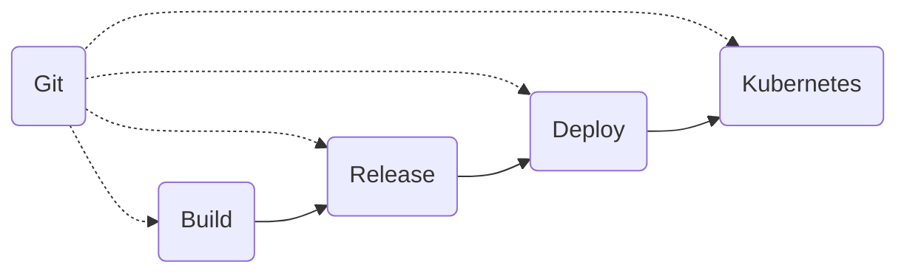

::left::

GitOps is a modern approach to software development and operations that emphasizes using Git as the single source of truth for defining, managing, and automating the entire software delivery lifecycle. It originated from the Cloud Native ecosystem and is commonly used in conjunction with Kubernetes and other container orchestration platforms.

::right::

In a GitOps workflow, all the configuration, infrastructure code, application code, and deployment specifications are version-controlled in a Git repository. The desired state of the system is defined in these Git repositories, and any changes to the system are made through pull requests and commits to these repositories. The operational aspects of the system are automated, with Git as the central trigger for changes to be applied to the running environment.

::footer::

---
layout: image-right
---

# GitOps

Overall, GitOps fosters a collaborative, automated, and auditable approach to operations, making it easier to manage complex systems and ensuring that the system's state always matches the desired state defined in the Git repository.

* A standard workflow for application development
* Increased security for setting application requirements upfront
* Improved reliability with visibility and version control through Git
* Consistency across any cluster, any cloud, and any on-premise environment

---
layout: default
---
# GitOps

Key benefits of GitOps for operations include:

1. Version Control and Auditing: With Git as the single source of truth, all changes to the system are recorded in a version-controlled history. This allows for easy auditing and tracking of changes, promoting transparency and accountability.
1. Reproducibility and Rollbacks: GitOps ensures that the entire system is described declaratively, which means it's easier to reproduce a specific state of the system by checking out a specific commit. Rollbacks become straightforward by reverting to a previous version in Git.
1. Consistency and Consensus: All team members collaborate using the same Git repository, leading to a shared understanding of the system's state and reducing the risk of configuration drift.
1. Continuous Delivery: GitOps enables continuous delivery by automating the process of updating the system whenever a new commit is made to the repository. This streamlines the deployment process, leading to faster and more reliable releases.
1. Infrastructure as Code (IaC): GitOps treats infrastructure as code, allowing operations teams to manage infrastructure and configuration in a programmable and version-controlled manner. This makes it easier to apply best practices like code reviews, testing, and collaboration.
1. Separation of Concerns: GitOps separates the roles of development and operations. Developers focus on writing code and configuration, while operations teams handle the automation and orchestration of deployments.
1. Observability and Control: GitOps allows operations teams to have better visibility into changes, who made them, and when they were applied. This enhances control and provides a clear audit trail.
1. Security: With Git as the single source of truth, access controls can be enforced, and changes can be reviewed before being applied, improving security and reducing the risk of unauthorized changes.

---

# Greymatter Core GitOps
## Best Practices

// TODO: review Git repository

---

# Tenant GitOps
## Best Practices

// TODO: review Git repository
